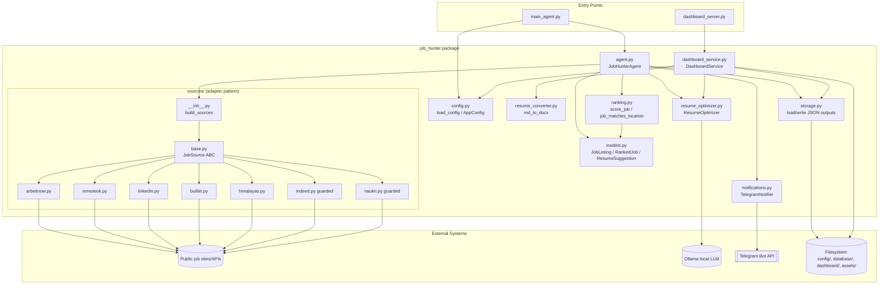
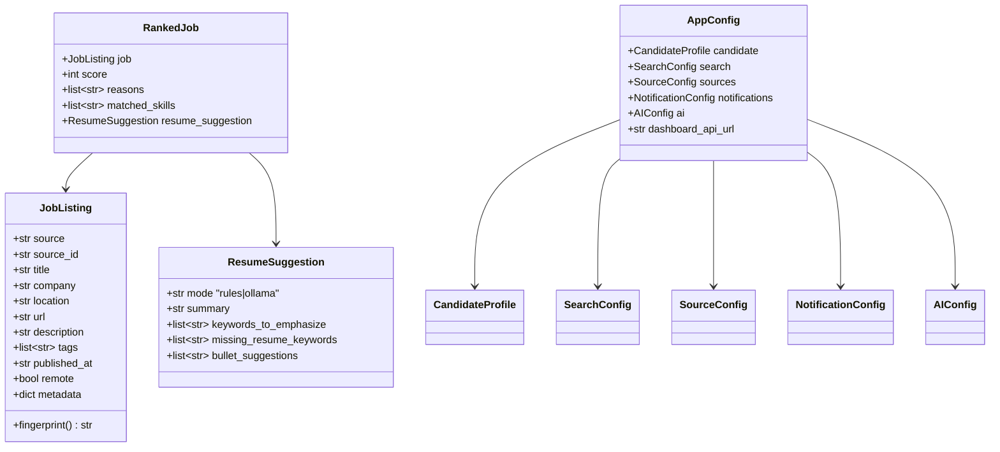
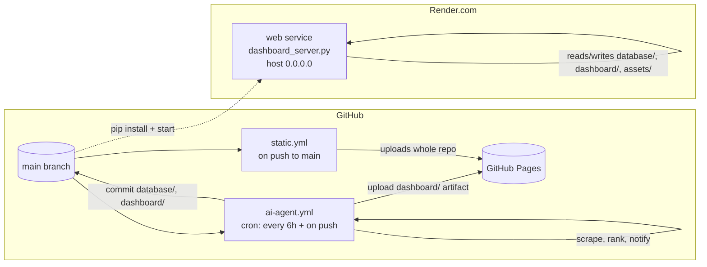

# Architecture Design — AI Job Hunter Agent

Companion to [HLD.md](HLD.md). This document covers component structure, data flow,
sequence diagrams, data model, storage layout, and deployment topology.

## 1. Component Overview



**Design pattern**: `sources/` implements a simple **adapter/strategy pattern** — every
source subclasses `JobSource` (abstract `fetch_jobs`) and shares helpers (keyword matching,
timestamp normalization, query/location building) from `base.py`. `build_sources()` is a
factory that reads `SourceConfig.enabled` and instantiates only the requested adapters,
making it straightforward to add a new job board without touching the agent's pipeline logic.

## 2. Runtime Sequence — Scheduled Agent Run

```mermaid
sequenceDiagram
    participant GHA as GitHub Actions
    participant Main as main_agent.py
    participant Agent as JobHunterAgent
    participant Src as JobSource(s)
    participant Rank as ranking.py
    participant Opt as ResumeOptimizer
    participant Notif as TelegramNotifier
    participant Store as storage.py

    GHA->>Main: python main_agent.py
    Main->>Agent: load_config() + JobHunterAgent(...)
    Main->>Agent: run()
    loop for each enabled source
        Agent->>Src: fetch_jobs(queries, keywords, locations)
        Src-->>Agent: list[JobListing] or Exception (caught)
    end
    Agent->>Agent: _deduplicate(raw_jobs) by URL/fingerprint
    Agent->>Rank: job_matches_location() + score_job() per job
    Rank-->>Agent: score, reasons, matched_skills
    Agent->>Agent: sort by score desc, recency, company, title; truncate to top_n
    Agent->>Opt: tailor(job, matched_skills) for top N (max_tailored_jobs)
    Opt-->>Agent: ResumeSuggestion (ollama or rule-based)
    Agent->>Store: load_seen_job_ids(state.json)
    Agent->>Notif: notify(new_ranked_jobs)
    Notif-->>GHA: Telegram messages sent (if enabled)
    Agent->>Store: write_outputs(ranked_jobs, summary, seen_job_ids, ...)
    Store-->>Agent: database/*.json + dashboard/*.json written
    Agent-->>Main: summary dict
    Main-->>GHA: prints summary JSON, exit code 0/1
    GHA->>GHA: git commit + push generated JSON
    GHA->>GHA: deploy dashboard/ to GitHub Pages
```

Key behavior: if **every** source fails, `JobHunterAgent.run()` raises before any file is
written, so a bad run never clobbers the last good published dataset.

## 3. Runtime Sequence — Interactive Resume Tailoring

```mermaid
sequenceDiagram
    participant UI as dashboard/app.js
    participant HTTP as dashboard_server.py
    participant Svc as DashboardService
    participant Opt as ResumeOptimizer
    participant FS as Filesystem

    UI->>HTTP: GET /api/health
    HTTP-->>UI: 200 OK (enables Tailor Resume button)
    UI->>HTTP: POST /api/tailor-resume {job_id}
    HTTP->>Svc: tailor_resume(job_id)
    Svc->>FS: read database/jobs.json, find job by fingerprint
    Svc->>FS: read assets/resume.md (or default template)
    Svc->>Opt: apply_tailoring(job, matched_skills, suggestion)
    Opt-->>Svc: tailored_resume, resume_fit_score, applied_keywords
    Svc->>FS: backup old resume to assets/resume.backups/
    Svc->>FS: write new assets/resume.md
    Svc->>FS: update resume_application_state.json (database/ + dashboard/)
    Svc-->>HTTP: application_state[job_id]
    HTTP-->>UI: 200 OK JSON result
    UI->>UI: re-render job card with fit score + applied badge
```

## 4. Data Model



`JobListing.fingerprint()` (SHA-1 of source + source_id + normalized company/title/url) is the
stable identity used for dedup, "seen" state, and dashboard job IDs — no database or
auto-increment key is needed.

## 5. Scoring Algorithm (`ranking.py`)

Additive, capped 0–100, fully explainable via a `reasons` list:

| Signal | Points | Notes |
|---|---|---|
| Each matched candidate skill found in title/description/tags | +12 each | uncapped count, but total score clamps to 100 |
| Preferred title substring match | +20 | first match only |
| Search keyword hits in job text | +4 each, capped at +10 | |
| Remote job + candidate is remote-first | +10 | else preferred-location substring match: +10 |
| Experience fit vs. years extracted from description (`\d+\+?\s+years` regex) | +8 if no requirement found; +12 if candidate meets it; −(up to 20) if candidate falls short | penalty scales with the gap |

Location filtering (`job_matches_location`) is a separate, optional gate controlled by
`search.strict_location_match` — when off, all jobs pass regardless of location text.

## 6. Storage & Publishing Design

Every run writes to **two parallel trees** with identical filenames:

- `database/` — the system of record (also holds `state.json`, the seen-jobs set, which is
  **not** duplicated to `dashboard/` since it's an internal dedup mechanism, not published data).
- `dashboard/` — the publish target consumed by the static frontend and, when the API server
  is running, also read/written live by `DashboardService`.

This split exists so the GitHub Actions workflow can commit both trees (audit trail in
`database/`) while `dashboard/` is the exact directory deployed to GitHub Pages —
no build step or templating is needed for the static site.

`dashboard/api_config.json` is generated each run with `{"api_url": dashboard_api_url}`,
letting the same static frontend work in both "static-only" (empty `api_url`, GitHub Pages)
and "API-backed" (Render URL) deployments without a code change.

## 7. Resume Tailoring Architecture

`ResumeOptimizer` has two independent capabilities that both degrade gracefully:

1. **Suggestion generation** (`tailor`): tries Ollama (`POST /api/generate`, JSON-formatted
   response) if `ai.ollama_model` is configured; falls back to deterministic rule-based
   suggestions (top matched/profile skills, templated summary and bullets) on any request
   failure, timeout, or malformed JSON.
2. **Resume rewriting** (`apply_tailoring`, dashboard-only): tries Ollama for full markdown
   rewriting with an explicit "do not invent experience" constraint; falls back to
   section-level upsert (`Professional Summary`, `Area of Expertise`) that only adds
   already-known skills/keywords, never fabricated content.

Both paths are pure-function-ish transformations over markdown text — section boundaries are
found via `## Heading` matching, so the resume file itself is the schema (no separate resume
data model).

## 8. Notification Architecture

`TelegramNotifier` is a thin, disabled-by-default wrapper: it only activates when
`telegram_enabled` is true **and** both a bot token and chat ID are present (env vars take
precedence over `config/profile.json`). Each new (previously-unseen) ranked job triggers one
synchronous `POST` to the Telegram Bot API; failures raise (via `raise_for_status()`) rather
than being swallowed, since notification delivery is a primary feature, not best-effort.

## 9. Deployment Topology



Two independent, non-exclusive hosting paths:

- **GitHub Pages (default, free)** — read-only dashboard; data refreshed every 6 hours by the
  scheduled workflow, which also commits the regenerated JSON so Pages always serves the
  latest run's output. `static.yml` is a broader "deploy the whole repo" fallback workflow.
- **Render (optional)** — runs `dashboard_server.py` as a persistent process, exposing the
  `/api/*` endpoints so the "Tailor Resume" feature works without a local server. `PORT` env
  var (set by Render) overrides the CLI `--port`/`--host` defaults and binds `0.0.0.0`.

Configuration for which mode the frontend uses is carried entirely through
`dashboard/api_config.json.api_url`, sourced from `DASHBOARD_API_URL` (env/secret) at agent
run time — no frontend rebuild is required to point it at a Render URL instead of "static only".

## 10. Configuration Management

`load_config()` merges, in priority order: **environment variables** (Telegram token/chat ID,
`OLLAMA_MODEL`, `OLLAMA_BASE_URL`, `DASHBOARD_API_URL`) over **`config/profile.json`** values,
falling back to dataclass defaults (`SourceConfig`, `AIConfig`). This lets GitHub Actions inject
secrets without ever writing them to the repo, while local development can use the plain JSON
file.

## 11. Security & Risk Notes

- Dashboard API (`dashboard_server.py`) has **no authentication** and sets
  `Access-Control-Allow-Origin: *` — intended for single-user/personal use only; do not expose
  it as a public multi-tenant service without adding auth.
- `POST /api/tailor-resume` writes directly to disk (`assets/resume.md`) based on a
  client-supplied `job_id` looked up against `database/jobs.json` — acceptable in a trusted,
  single-user context but would need input/identity validation before wider exposure.
- Secrets (Telegram token, Ollama URL) flow only through environment variables / GitHub
  Secrets, never committed to `config/profile.json` in source control (see
  `config/profile.example.json` as the checked-in template vs. the real `config/profile.json`).
- Outbound scraping requests spoof a browser `User-Agent` (`base.py`) — acceptable for personal
  aggregation of public listings; operators should respect each site's terms of service.

## 12. Technology Stack

| Layer | Technology |
|---|---|
| Language/runtime | Python 3.11 |
| HTTP client | `requests` |
| HTML parsing | `beautifulsoup4` |
| Resume DOCX export | `python-docx` |
| Dashboard API server | Python standard library `http.server.ThreadingHTTPServer` |
| Frontend | Vanilla HTML/CSS/JS (`dashboard/index.html`, `app.js`, `styles.css`) |
| Optional AI | Local Ollama server via REST (`/api/generate`) |
| Notifications | Telegram Bot API |
| Storage | Flat JSON files (`database/`, `dashboard/`) — no database engine |
| CI/CD & scheduling | GitHub Actions (`ai-agent.yml`, `static.yml`) |
| Hosting | GitHub Pages (static) + Render (optional interactive API host) |
| Tests | `tests/` (pytest-style) covering storage, ranking, resume optimizer, dashboard service |
