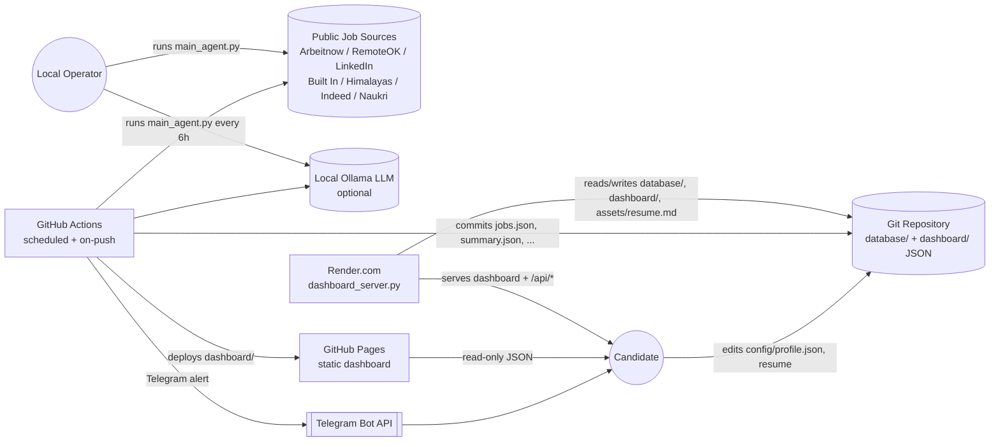

# High-Level Design (HLD) — AI Job Hunter Agent

## 1. Purpose

The AI Job Hunter Agent is a Python-based automation system that searches multiple public
job sources, scores listings against a candidate's profile, tailors resume content per job,
sends Telegram alerts for new matches, and publishes results to a static/interactive
dashboard. It runs both as a local CLI tool and as a scheduled GitHub Actions job.

## 2. Goals

- Aggregate job listings from several free/public sources without requiring paid job-board APIs.
- Rank listings against a single candidate profile using explainable, rule-based scoring.
- Avoid duplicate alerts across runs by persisting a "seen jobs" state.
- Offer optional, non-fabricating resume tailoring (rule-based, or local LLM via Ollama).
- Publish results as static JSON consumable by a lightweight dashboard, with an optional
  API layer for interactive actions (one-click resume tailoring).
- Run unattended on a schedule with zero paid infrastructure (GitHub Actions + GitHub Pages),
  while still supporting a hosted interactive mode (Render).

## 3. Non-Goals

- No multi-tenant/multi-user support — one candidate profile per deployment.
- No relational database — all state and output are flat JSON files.
- No authentication/authorization layer on the dashboard API.
- No guaranteed scraping of sites with strong bot protection (Indeed, Naukri are best-effort
  and fail closed with an explicit error).
- No horizontal scaling — single-process, synchronous execution per run.

## 4. Users / Stakeholders

| User | Interaction |
|---|---|
| Candidate (primary user) | Owns `config/profile.json`, receives Telegram alerts, uses the dashboard to browse/tailor resumes |
| GitHub Actions (scheduler) | Runs the agent every 6 hours and on push to `main`; commits generated artifacts; deploys dashboard to Pages |
| Render (optional host) | Hosts `dashboard_server.py` for a live, API-backed dashboard experience |
| Local operator | Runs `main_agent.py` and `dashboard_server.py` manually during development |

## 5. Functional Requirements

1. Fetch job listings from configurable sources: Arbeitnow, RemoteOK, LinkedIn, Built In,
   Himalayas (enabled by default), Indeed and Naukri (guarded/best-effort).
2. Deduplicate listings by normalized URL (fallback to a content fingerprint).
3. Score each listing 0–100 using skill, title, keyword, location/remote, and experience-fit
   signals; filter by `min_score` and cap results at `top_n`.
4. Persist a set of "seen" job fingerprints so repeat runs only notify on new matches.
5. Send a Telegram message per new, qualifying match (optional, config-gated).
6. Generate a `ResumeSuggestion` (summary, keywords, missing keywords, bullet ideas) for the
   top N ranked jobs — via a local Ollama model if configured, else deterministic rules.
7. Write run outputs to both `database/` (system of record) and `dashboard/` (published copy).
8. Serve a static dashboard (HTML/JS/CSS) that reads the published JSON directly from disk
   or over HTTP, with graceful degradation when no API server is present.
9. When the optional API server (`dashboard_server.py`) is running, support:
   - health check,
   - resume metadata retrieval and `.docx` download,
   - one-click "Tailor Resume" that rewrites `assets/resume.md`, keeps a timestamped backup,
     and records per-job application state with a resume fit score.
10. Fail a run only if *all* sources error; partial source failures degrade gracefully and are
    reported in `summary.source_stats`.

## 6. Non-Functional Requirements

- **Portability**: pure Python + `requests`/`beautifulsoup4`/`python-docx`; dashboard server
  uses only the standard library (`http.server`) — no framework dependency.
- **Resilience**: per-source try/except isolation; a broken scraper cannot fail the whole run.
- **Idempotency**: re-running without new jobs does not re-notify; outputs are fully
  regenerated from the latest run's ranked list except for state files, which merge.
- **Observability**: every run emits a `summary.json` with counts, per-source status, and score
  threshold used — enough to diagnose a bad run without logs.
- **Cost**: zero-cost automation path (GitHub Actions free tier + GitHub Pages); optional
  low-cost hosting via Render for the interactive variant.
- **Data privacy**: candidate profile and resume are local files; secrets (Telegram token,
  Ollama endpoint) are supplied via environment variables / GitHub Secrets, never committed.

## 7. System Context

## 8. Key User Journeys

### 8.1 Scheduled scrape-and-alert (fully automated)
1. GitHub Actions cron fires every 6 hours.
2. `main_agent.py` loads `config/profile.json`, fetches from all enabled sources, ranks,
   filters, and tailors resumes for the top matches.
3. New matches (not previously seen) trigger Telegram notifications.
4. Outputs are written to `database/` and `dashboard/`, committed back to the repo, and the
   `dashboard/` directory is deployed to GitHub Pages.

### 8.2 Read-only dashboard browsing
1. Candidate opens the GitHub Pages URL.
2. The frontend (`dashboard/app.js`) reads `jobs.json`, `summary.json`,
   `resume_suggestions.json`, and `resume_application_state.json` directly as static files.
3. No API is available in this mode, so "Tailor Resume" is disabled — the UI shows read-only
   status text.

### 8.3 Interactive resume tailoring
1. Candidate runs `python dashboard_server.py` locally, or the Render service is live.
2. The frontend detects the API via `GET /api/health` and enables the "Tailor Resume" action.
3. Clicking it calls `POST /api/tailor-resume` with a `job_id` (job fingerprint).
4. `DashboardService.tailor_resume` loads the ranked job, generates/reuses a
   `ResumeSuggestion`, rewrites `assets/resume.md` in place, writes a timestamped backup under
   `assets/resume.backups/`, computes a `resume_fit_score`, and records the outcome in
   `resume_application_state.json` (both `database/` and `dashboard/` copies).

## 9. Constraints & Known Limitations

- Indeed/Naukri sources are explicitly best-effort and commonly return an error due to bot
  protection or client-side-only rendering — this is by design, not a defect.
- State (`state.json`) and application state are plain JSON with no locking; concurrent writes
  (e.g., two simultaneous tailor-resume requests) are not protected against races.
- The dashboard API has no authentication and permits CORS from any origin (`*`) — acceptable
  for a single-user personal tool, not for multi-tenant or public deployment.
- LinkedIn/Built In/Himalayas scraping depends on public HTML structure and will break silently
  (return fewer/no jobs) if the target site changes markup.
